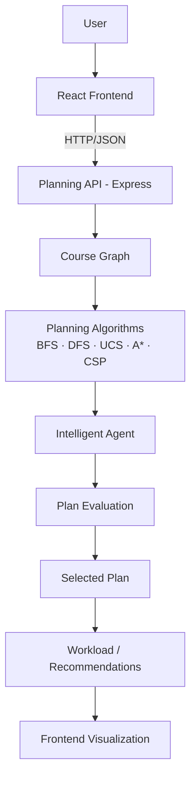

# AI Course Planner

> A goal-based intelligent academic planning system that models university courses as a prerequisite graph and generates semester plans under user-defined objectives and constraints.

## 1. Problem

Students face a combinatorial scheduling problem: dozens of courses linked by prerequisite chains, each with credits and difficulty, must be sequenced into semesters that respect every dependency plus per-semester credit, difficulty and count limits — while serving different personal objectives (graduate fast, keep it easy, balance load, prioritize a specialization).

## 2. Motivation

Manual planning is error-prone (a single misplaced prerequisite invalidates a whole degree plan) and single-strategy tools force every objective through one algorithm. This project treats planning as explicit graph search plus constraint reasoning, so strategies can be compared honestly and a goal-based agent can pick the right one per objective.

## 3. Solution

Model courses as a directed prerequisite graph, generate candidate semester plans with five classical planners (BFS, DFS, UCS, A*, CSP), score the candidates with an explicit per-goal utility function, and return the winner through a goal-based intelligent agent — with workload analysis, recommendations, and a full decision log. Everything is served by an Express API and visualized in a React frontend.

## 4. System Architecture



Details, module map and request flows: [`docs/architecture.md`](docs/architecture.md).

## 5. Course Graph Representation

- **Node:** a course (`id`, `name`, `credits`, `difficulty 1–5`, `tags`, `prerequisites`).
- **Edge:** `prerequisite → course` (directed; the graph must be a DAG — cycles are detected and rejected).
- **Rule:** a prerequisite must be completed in a **strictly earlier semester**, never the same one. One shared validator (`server/utils/planValidator.js`) enforces this for every planner, test and benchmark.
- Utilities (`topological sort`, frontier computation, critical-path depth, cycle detection) live in `server/utils/graphUtils.js`; the bundled dataset (`server/data/sampleCourses.js`, 82 courses) is a valid DAG with depth-derived semester hints.

## 6. Algorithms Implemented

| Algorithm | Idea | Cost / heuristic |
|---|---|---|
| **BFS** | Layer-by-layer semester packing from the available frontier | None (easiest-first within a layer) |
| **DFS** | Post-order topological traversal, then semester packing | None (baseline) |
| **UCS** | Cheapest-available-first via min-heap | `g` = cumulative difficulty |
| **A\*** | Semester-state search over `f = g + h` | `g` = difficulty so far; `h` = remaining chain depth (heuristic, not proven admissible) |
| **CSP** | Backtracking + forward checking, MRV + LCV | Declarative hard constraints |

No optimality is claimed — see [`docs/algorithms.md`](docs/algorithms.md) for strategy, complexity, strengths and limitations of each.

## 7. Intelligent Planning Agent

A deterministic, rule-based **goal-based planning agent** (no LLM, no learned policy):

```text
PERCEPTION (graph metrics) → REASONING (goal → candidate strategies)
→ ACTION (run candidates) → UTILITY SCORING (scorePlan)
→ DECISION (argmax) → workload analysis + recommendations
```

Goals: `fastest` (BFS+A*), `easiest` (UCS+A*), `balanced` (A*+BFS), `specialization` (A*+BFS+UCS). Every stage is recorded in an inspectable `agentLog`. Full pipeline, formulas and determinism notes: [`docs/intelligent-agent.md`](docs/intelligent-agent.md).

## 8. Frontend

React 19 + Vite + Tailwind (`client/src`): dashboard shell with tabbed views — course manager, d3 force-directed prerequisite graph (group colors, difficulty rings, tooltips), algorithm step-trace playback, semester timeline with workload bars, pairwise algorithm comparison, what-if simulator, and the agent console (strategy scores, plan/workload/recommendations/log tabs). The frontend embeds no planning logic; it renders API results.

## 9. Backend

Node.js + Express (`server/`): pure planner modules with no HTTP imports, thin route layer (`courses`, `planning`, `simulation`), in-memory course store preloaded with the sample dataset, and a shared validator. `index.js` binds a port only when run directly, so tests import the app cleanly.

## 10. API

| Method | Route | Purpose |
|---|---|---|
| POST | `/api/planning/run` | Run one algorithm |
| POST | `/api/planning/compare` | Compare two algorithms on identical input |
| POST | `/api/planning/agent` | Run the intelligent agent |
| GET | `/api/planning/graph` | Nodes, edges, statistics for visualization |
| * | `/api/courses/*` | Dataset CRUD + sample/default loading |
| POST | `/api/simulation/*` | Fail-course / complete / what-if scenarios |
| GET | `/api/health` | Status + loaded-course count |

Full request/response shapes: [`docs/api.md`](docs/api.md).

## 11. Testing

`node:test` + `node:assert/strict`, zero new dependencies. Covers algorithm correctness on shared fixtures (chains, branching, deep chains, limits, completed sets, empty/invalid/cyclic/duplicate inputs), agent decision logic, and live HTTP route behavior:

```bash
cd server
npm test
```

Method and layout: [`docs/testing.md`](docs/testing.md).

## 12. Benchmark Methodology

Same fixtures through all five planners; only measured metrics (validity, semesters, nodes explored, median wall time, cost, steps). Deterministic apart from wall time, which must be re-measured per machine:

```bash
cd server
npm run benchmark
```

Method, fixtures and the results table: [`docs/evaluation.md`](docs/evaluation.md).

## 13. Example Output

Three-course chain `A → B → C`, no completed courses, default limits — every planner returns three semesters in dependency order:

```json
{
  "algorithm": "BFS",
  "success": true,
  "totalSemesters": 3,
  "semesterPlan": [
    { "semester": 1, "courses": ["A"], "totalCredits": 3 },
    { "semester": 2, "courses": ["B"], "totalCredits": 3 },
    { "semester": 3, "courses": ["C"], "totalCredits": 3 }
  ]
}
```

The agent wraps the winning plan with `chosenStrategy`, per-strategy scores, `workloadAnalysis` (`Light/Moderate/Heavy` per semester), `recommendations`, and the `agentLog`.

## 14. Limitations

Prototype, not an academic advisor: no institutional graduation-rule validation; difficulty/credit metadata are estimates; CSP is backtrack-budgeted and A* iteration-capped (both degrade to reported failure, never silent invalid plans); benchmarks characterize this planner only. Evidence notes: [`docs/evidence.md`](docs/evidence.md).

## 15. How to Run Locally

Prerequisites: Node.js 18+.

```bash
# backend
cd server
npm install
npm test              # correctness suite
npm run benchmark     # reproducible comparison
npm start             # http://localhost:5050/api/health

# frontend (new terminal)
cd client
npm install
npm run dev           # Vite app, talks to the API above
```

## 16. Repository Structure

```text
AI_Couse_Planner/
├── README.md
├── docs/
│   ├── architecture.md
│   ├── algorithms.md
│   ├── intelligent-agent.md
│   ├── api.md
│   ├── evaluation.md
│   ├── testing.md
│   └── evidence.md
├── client/                  # React + Vite frontend
└── server/
    ├── algorithms/          # BFS, DFS, UCS, A*, CSP, intelligent agent
    ├── data/                # sample course dataset
    ├── routes/              # courses, planning, simulation APIs
    ├── utils/               # graph utils, plan validator, default track
    ├── tests/               # node:test suite
    └── scripts/benchmark.js # reproducible benchmark
```

## 17. Technology Stack

Backend: Node.js, Express, body-parser, cors, uuid. Frontend: React 19, Vite, axios, d3, framer-motion, lucide-react, Tailwind CSS. Testing/benchmark: Node built-in `node:test`, `node:assert/strict`, `perf_hooks` — no extra dependencies.
