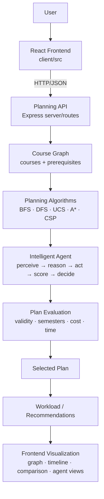

# Architecture

## High-Level Architecture



Every box above exists in the repo — nothing is aspirational. Text fallback of the same flow:

```text
React Client
    |
    | HTTP/JSON
    v
Express API
    |
    +--> Course Store (server/routes/courses.js, in-memory)
    |
    +--> Planning Routes (server/routes/planning.js)
              |
              +--> BFS / DFS / UCS / A* / CSP
              +--> Intelligent Agent
                        |
                        +--> perception
                        +--> strategy selection
                        +--> candidate execution
                        +--> utility scoring
                        +--> decision
    |
    v
Planning Result / Graph Data  -->  Frontend Visualization
```

## Course Graph

A course is a node; each prerequisite is a directed edge:

```text
Prerequisite ---> Course
```

Implementation: `server/utils/graphUtils.js` (`buildAdjacencyList`, `topologicalSort` via Kahn's algorithm, `prerequisitesSatisfied`, `getAvailableCourses`, `calculateCriticalPath`, ancestor/reachability helpers). The dataset in `server/data/sampleCourses.js` (82 courses across Math, CS, Systems, AI/ML, DL, NLP, CV, RL, Data Science, electives, capstone) is a DAG; `recommendedSemester` values are derived from prerequisite depth. A curated default degree track is built by `server/utils/defaultTrack.js`.

Graph statistics for visualization come from `GET /api/planning/graph` (nodes with difficulty color/group, edges, totals, tag and difficulty distributions).

## Module Map

| Path | Responsibility |
|---|---|
| `server/index.js` | Express app, CORS, dataset auto-load, health check. Binds a port only when run directly, so tests can import the app without side effects. |
| `server/algorithms/` | `bfs.js`, `dfs.js`, `ucs.js`, `astar.js`, `csp.js`, `agent.js` — pure planners, no HTTP. |
| `server/routes/` | `courses.js` (CRUD + dataset loading, owns the in-memory store), `planning.js` (`/run`, `/compare`, `/agent`, `/graph`), `simulation.js` (fail-course / complete / what-if scenarios). |
| `server/data/` | `sampleCourses.js` — the large DAG dataset. |
| `server/data/` | `programs.js` — degree catalog (explicit required-course lists + 8/8 hard caps), since the dataset has no degree field. |
| `server/algorithms/` | `degreePlanner.js` — program-scoped 8-semester scheduler reusing graph utils, goal semantics and the shared timeline validator. |
| `server/utils/` | `graphUtils.js` (graph ops), `planValidator.js` (shared correctness rules used by planners, tests, benchmark), `defaultTrack.js` (degree-track subset). |
| `server/tests/` | `helpers.js`, `algorithms.test.js`, `agent.test.js`, `api.test.js` — `node:test`, zero new dependencies. |
| `server/scripts/benchmark.js` | Reproducible cross-algorithm benchmark; method in `docs/evaluation.md`. |
| `client/src` | `store/AppContext.jsx` (global state, API calls), `utils/api.js` (axios client), `components/` (Dashboard, CourseManager, GraphView (d3 force graph), AlgorithmViz (step-trace playback), SemesterTimeline, ComparisonMode, WhatIfSimulator, AgentPlanner). |

## Request Flows

- **Single plan:** `AlgorithmViz`/`SemesterTimeline` → `POST /api/planning/run` → chosen planner → `{ semesterPlan, nodesExplored, steps, executionTimeMs, ... }` → semester cards + step-trace playback + workload bars.
- **Comparison:** `ComparisonMode` → `POST /api/planning/compare` → two planners on identical input → metric table + winner badges + side-by-side plans.
- **Agent:** `AgentPlanner` → `POST /api/planning/agent` → `intelligentAgent()` → chosen plan + strategy scores + workload analysis + recommendations + `agentLog` → strategy bars, plan/workload/recommendations/log tabs.
- **Graph:** `GraphView` → `GET /api/planning/graph` → d3 force-directed prerequisite graph with difficulty rings, group colors, tooltips, selection detail.
- **What-if:** `WhatIfSimulator` → `POST /api/simulation/*` → revised plan under failed/completed/excluded-course scenarios.

## Design Rationale

Planners are pure functions of `(courses, constraints, completed, goal)` with no HTTP or UI imports, so each strategy can be unit-tested and benchmarked in isolation while the API guarantees identical inputs for comparisons. The shared `planValidator` makes "valid" mean the same thing everywhere. The frontend embeds no planning logic — it only renders what the backend returns.
