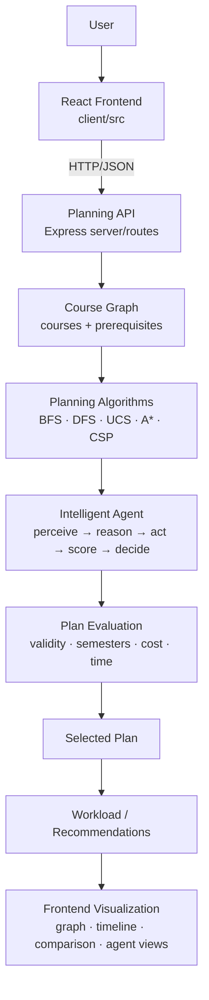

# Architecture

## High-Level Architecture



Every box above exists in the repo — nothing is aspirational. Text fallback of the same flow:

```text
React Client
    |
    | HTTP/JSON
    v
Express API
    |
    +--> Course Store (server/routes/courses.js, in-memory)
    |
    +--> Planning Routes (server/routes/planning.js)
              |
              +--> BFS / DFS / UCS / A* / CSP
              +--> Intelligent Agent
                        |
                        +--> perception
                        +--> strategy selection
                        +--> candidate execution
                        +--> utility scoring
                        +--> decision
    |
    v
Planning Result / Graph Data  -->  Frontend Visualization
```

## Course Graph

A course is a node; each prerequisite is a directed edge:

```text
Prerequisite ---> Course
```

Implementation: `server/utils/graphUtils.js` (`buildAdjacencyList`, `topologicalSort` via Kahn's algorithm, `prerequisitesSatisfied`, `getAvailableCourses`, `calculateCriticalPath`, ancestor/reachability helpers). The dataset in `server/data/sampleCourses.js` (82 courses across Math, CS, Systems, AI/ML, DL, NLP, CV, RL, Data Science, electives, capstone) is a DAG; `recommendedSemester` values are derived from prerequisite depth. A curated default degree track is built by `server/utils/defaultTrack.js`.

Graph statistics for visualization come from `GET /api/planning/graph` (nodes with difficulty color/group, edges, totals, tag and difficulty distributions).

## Planning Scope (single source of truth)

The selected program/course defines the planning scope. Planning, graph visualization, algorithm comparison, timeline generation, workload analysis, and scenario planning operate only within that scope.

```text
Selection (programId XOR targetCourseId)
   ↓
resolvePlanningScope(selection, catalog)   [server/utils/scopeResolver.js — the ONLY scope logic]
   → scoped courses + edges + stats (or a no-fallback error)
   ↓
scopedGraph → planner (BFS/DFS/UCS/A*/CSP/agent/degree, unchanged)
   ↓
shared cap post-check (8 semesters / 8 per semester, never truncated silently)
   ↓
scoped plan + scope metadata + validation → UI
```

- **Program mode:** explicit curriculum in `server/data/programs.js` plus auto-included prerequisite ancestors (the dataset has no degree field; tag overlap cannot define a degree).
- **Individual-course mode:** target course plus its transitive prerequisite closure (`getAllAncestors`) — ancestors only, never unrelated courses or dependents.
- **No global fallback:** missing/invalid/unresolvable selection returns `SELECTION_REQUIRED` / `UNKNOWN_*` / `MISSING_DEPENDENCIES` / `CYCLIC_SCOPE`. The full catalog is used only for dataset CRUD and the graph-overview browser.
- The frontend is never authoritative: `AppContext` holds `selectedProgramId`/`targetCourseId`, sends them with every call, clears derived results on change, and disables planning buttons until a selection exists. The backend re-resolves and validates scope server-side.

## Module Map

| Path | Responsibility |
|---|---|
| `server/index.js` | Express app, CORS, dataset auto-load, health check. Binds a port only when run directly, so tests can import the app without side effects. |
| `server/algorithms/` | `bfs.js`, `dfs.js`, `ucs.js`, `astar.js`, `csp.js`, `agent.js` — pure planners, no HTTP. |
| `server/routes/` | `courses.js` (CRUD + dataset loading, owns the in-memory store), `planning.js` (`/run`, `/compare`, `/agent`, `/graph`), `simulation.js` (fail-course / complete / what-if scenarios). |
| `server/data/` | `sampleCourses.js` — the large DAG dataset. |
| `server/data/` | `programs.js` — degree catalog (explicit required-course lists + 8/8 hard caps), since the dataset has no degree field. |
| `server/algorithms/` | `degreePlanner.js` — program-scoped 8-semester scheduler reusing graph utils, goal semantics and the shared timeline validator. |
| `server/utils/` | `graphUtils.js` (graph ops), `planValidator.js` (shared correctness rules used by planners, tests, benchmark), `scopeResolver.js` (single scope-resolution + route post-check), `defaultTrack.js` (degree-track subset). |
| `server/tests/` | `helpers.js`, `algorithms.test.js`, `agent.test.js`, `api.test.js`, `scope.test.js`, `simulation.test.js`, `degree.test.js` — `node:test`, zero new dependencies. |
| `server/scripts/benchmark.js` | Reproducible cross-algorithm benchmark; method in `docs/evaluation.md`. |
| `client/src` | `store/AppContext.jsx` (global state, API calls), `utils/api.js` (axios client), `components/` (Dashboard, CourseManager, GraphView (d3 force graph), AlgorithmViz (step-trace playback), SemesterTimeline, ComparisonMode, WhatIfSimulator, AgentPlanner). |

## Request Flows (all scope-first)

- **Single plan:** `AlgorithmViz`/`SemesterTimeline` (+ `ScopePicker` selection) → `POST /api/planning/run` → scope resolution → chosen planner on scoped set → cap post-check → `{ scope, semesterPlan, validation, ... }` → semester cards + step-trace playback + workload bars.
- **Comparison:** `ComparisonMode` → `POST /api/planning/compare` → one scope feeds both planners → metric table + winner badges + side-by-side scoped plans.
- **Agent:** `AgentPlanner` → `POST /api/planning/agent` → `intelligentAgent()` on the scoped set (every candidate plans the same scope) → chosen plan + strategy scores + workload analysis + recommendations + `agentLog`.
- **Graph:** `GraphView` → `GET /api/planning/graph` (+ scope params when selected) → scoped subgraph or full-catalog overview.
- **What-if:** `WhatIfSimulator` → `POST /api/simulation/*` (+ selection; membership enforced) → scoped revised plan.

## Design Rationale

Planners are pure functions of `(courses, constraints, completed, goal)` with no HTTP or UI imports, so each strategy can be unit-tested and benchmarked in isolation while the API guarantees identical inputs for comparisons. The shared `planValidator` makes "valid" mean the same thing everywhere. The frontend embeds no planning logic — it only renders what the backend returns.
